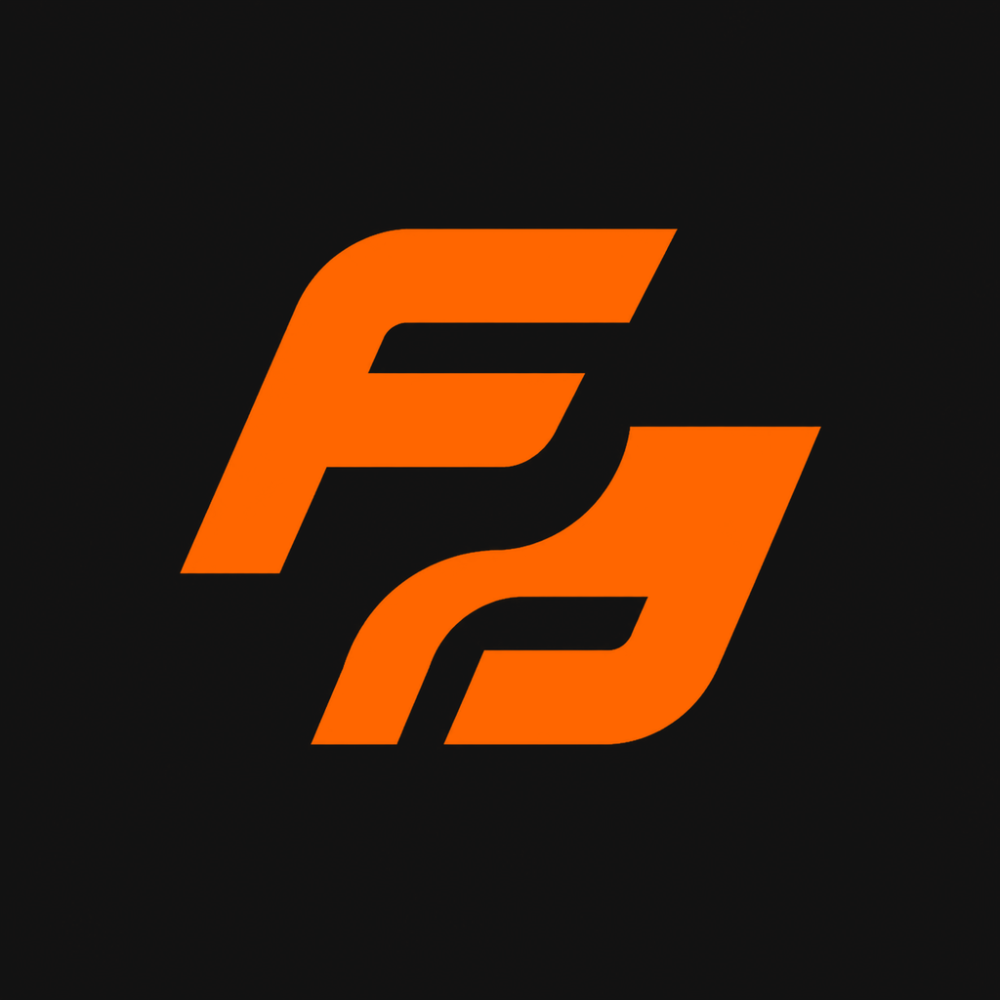

# 🏋️ FitFlow

<p align="center">
  
</p>

> Aplicativo de gerenciamento, acompanhamento e evolução de treinos desenvolvido em Flutter.

---

## 💡 Proposta de Valor
Transformar a experiência de treino em algo simples, intuitivo e mensurável. O aplicativo capacita o usuário a assumir o controle total da sua evolução física — seja por aumento de cargas na musculação ou ganho de resistência no cardio —, oferecendo tanto rotinas prontas quanto liberdade total para montagem de treinos personalizados, tudo em uma interface fluida com modo escuro nativo.

---

## 🎯 Descrição do Problema
Muitos praticantes de atividades físicas enfrentam dificuldades para manter o histórico de sua evolução na academia. O uso de anotações em papel se perde, planilhas tradicionais são complexas para o uso rápido entre uma série e outra, e a maioria dos aplicativos do mercado é poluída, cheia de anúncios ou exige assinaturas caras para recursos básicos de registro de carga e tempo. 

O app resolve isso oferecendo um fluxo rápido de **"Iniciar/Terminar Treino"**, permitindo um check-in ágil dos exercícios concluídos em tempo real e gerando comparativos visuais de progresso ao longo dos meses.

---

## 👥 Público-Alvo
* Praticantes de musculação, musculação em circuito, corrida ou spinning.
* Alunos de academias que buscam autonomia para registrar suas cargas e acompanhar o ganho de força/resistência.
* Pessoas que valorizam um design limpo, rápido e sem distrações durante o treino.

---

## 🚀 Principais Funcionalidades (MVP)
* **Sessão de Treino Ativa:** Botão rápido para iniciar e encerrar o treino, com sistema de *check-in* interativo para marcar os exercícios já realizados.
* **Registro de Métricas Flexíveis:** Anotação de cargas de peso (para musculação) e tempo de exercício (para spinning ou corrida).
* **Treinos Prontos vs. Personalizados:** Biblioteca de sugestões de treinos pré-configurados e criador intuitivo para montar rotinas do zero.
* **Histórico e Evolução Mensal:** Gráficos e comparativos de desempenho ao longo dos meses para visualizar a progressão de cargas e tempo.

---

## 🎨 Desenvolvimento de Marca & Identidade Visual

### Logo


Monograma formado por duas letras **F**, a segunda rotacionada em 180°, encaixadas em um bloco contínuo. A inclinação para a frente comunica movimento e progressão; a leitura funciona tanto como "FF" quanto como forma única, o que mantém o ícone estável em tamanhos pequenos.

* **Aplicação:** laranja `#FF6600` sobre preto grafite `#121212`, sem degradê e sem sombra.
* **Arquivo:** `assets/brand/fitflow-logo.png` (1024×1024)
* **Uso:** ícone do aplicativo em Android, iOS e web.

### Nome e Naming Rationale
**FitFlow**

* **Construção:** *Fit* (condicionamento físico, o objetivo de quem usa) + *Flow* (fluidez, o estado de concentração ininterrupta durante o treino). Duas sílabas tônicas e aliteração em /f/, o que favorece a memorização e a leitura rápida no ícone do app.
* **Rationale:** O nome carrega a promessa central do produto — registrar carga, tempo e progresso **sem quebrar o ritmo da série**. Enquanto os concorrentes se posicionam pelo volume de recursos, o FitFlow se posiciona pela ausência de atrito: o app existe para sair da frente do treino, não para competir com ele.
* **Por que funciona no nicho:** "estar em *flow*" já é vocabulário corrente entre praticantes, então o nome comunica o benefício sem precisar de explicação. É curto (7 letras), pronunciável em português e inglês e livre de acento — o que simplifica a busca em loja de aplicativos e o registro de domínio.

### Tom de Voz
Direto, encorajador e sem firula. O FitFlow fala como um parceiro de treino experiente: objetivo na hora da execução, comemorativo na hora do resultado — nunca professoral, nunca agressivo.

* **Somos:** diretos, motivacionais, informais na medida certa, orientados a número.
* **Não somos:** sarcásticos, culpabilizadores, cheios de jargão técnico ou "coach de internet".
* **Regra prática:** durante o treino, no máximo 4 palavras por comando — o usuário está com o celular na mão, entre uma série e outra.
* **Sobre resultado:** o número fala mais alto que o adjetivo. Preferimos "+5 kg no supino" a "você foi incrível".
* **Sobre falha:** ausência de treino nunca vira cobrança. O app registra, não julga.

| Situação | ✅ Falamos assim | ❌ Não falamos assim |
|---|---|---|
| Abertura do app | "Bora treinar?" | "Bem-vindo ao seu ambiente de gestão de atividades físicas." |
| Iniciar sessão | "INICIAR TREINO" | "Clique aqui para dar início à sua sessão" |
| Exercício concluído | "Feito." | "Parabéns, você arrasou demais! 💪🔥" |
| Evolução de carga | "+5 kg desde julho" | "Sua performance apresentou incremento" |
| Semana sem treino | "Faz 6 dias. Bora?" | "Você abandonou seus objetivos." |
| Estado vazio | "Nenhum treino ainda. Monte o primeiro." | "Não há dados disponíveis no momento." |
| Erro | "Não deu pra salvar. Tenta de novo?" | "Erro 500: falha inesperada na aplicação." |

### Paleta de Cores
A identidade visual foi construída priorizando o conforto visual em ambientes internos de academia (Modo Escuro) e o estímulo à energia:
* **Laranja Vibrante (Acento / CTA):** `#FF6600` — Usado em botões principais de ação (Iniciar/Terminar Treino), ícones ativos e alertas de destaque.
* **Preto Grafite (Fundo Principal):** `#121212` — Fundo das telas, reduz o cansaço visual e economiza bateria.
* **Cinza Escuro (Cards e Blocos):** `#1E1F26` — Delimitação de blocos de exercícios e menus.
* **Branco / Gelo (Textos e Títulos):** `#F8F9FA` — Máxima legibilidade para números de carga e cronômetros.
* **Cinza Claro (Textos Secundários):** `#8C8D94` — Legendas, rótulos de seção e informações de apoio.

> As cinco cores estão implementadas em `lib/app/theme.dart`, na classe `FitFlowColors` (constantes `darkPrimary`, `darkBackground`, `darkSurface`, `darkText` e `darkTertiary`). O modo escuro é o **padrão** do app.

#### Modo claro (adicionado no CP5)
Opcional, ativado em **Perfil → Configurações**. Mantém a mesma estrutura de telas e troca apenas a paleta:
* **Roxo Principal:** `#6D28D9` · **Roxo Secundário:** `#8B5CF6`
* **Fundo:** `#FFFFFF` · **Cards:** `#F6F3FB`
* **Texto:** `#18181B` · **Cinza-azulado (secundário):** `#64748B`

> As telas leem a paleta ativa com `FitFlowColors.of(context)`, então nenhuma cor fica fixa no código das telas.

### Tipografia
* **Fonte Primária:** **Roboto** — sans-serif de alta legibilidade em telas pequenas, especialmente para números de carga e cronômetro. É a fonte nativa do Material Design e já acompanha o Flutter, então não depende de pacote externo nem de download em tempo de execução.
* **Escala tipográfica** (definida em `lib/app/theme.dart`):

| Uso | Estilo | Tamanho / Peso |
|---|---|---|
| Título de tela | `displaySmall` | 30 / w900 |
| Número de destaque (carga, tempo, %) | `headlineSmall` | 24 / w900 |
| Nome do treino no card | `titleLarge` | 23 / bold |
| Subtítulo | `titleMedium` | 18 / bold |
| Rótulo de seção (caixa alta) | widget `SectionTitle` | 13 / bold / *letter-spacing* 1 |
| Texto de apoio | `bodyMedium` | 14 / regular |

* **Racional dos pesos altos (w900):** durante o treino a tela é lida de relance, com o celular na mão entre uma série e outra — peso alto e contraste forte reduzem o tempo de leitura.

---

## 💼 Ideia de Venda (Pitch) & Diferencial Competitivo
**Por que este app existiria no mercado?**
Enquanto concorrentes focam em redes sociais fitness excessivas ou interfaces confusas, nossa proposta foca na **velocidade de uso durante o descanso da série** e na **clareza da evolução**. 

* **Modelo de Negócio:** Freemium (recursos essenciais de registro e histórico 100% gratuitos, com futuras expansões para relatórios avançados de inteligência de treino).
* **Diferencial:** Experiência de usuário (UX) extremamente simplificada, unindo o melhor de dois mundos: suporte a treinos de força (cargas) e cardiovasculares (tempo/spinning) em uma interface moderna nas cores laranja, preto e cinza.

---

## 📱 Protótipo Funcional (CP5)

O protótipo implementa o fluxo principal do MVP com **dados mockados**, sem depender de backend. Todas as telas são navegáveis e as ações do usuário atualizam o app em tempo de execução.

### Fluxo de telas

```text
Início ──► Treino em andamento ──► Resumo ("Treino finalizado!") ──► Início (métricas atualizadas)
  │
Treinos ──► Detalhe do treino ──► Treino em andamento
  │    └──► Criar treino ──► (novo treino aparece na lista)
  │
Evolução (gráfico de carga + histórico de treinos concluídos)
  │
Perfil ──► Dados pessoais
       ├──► Configurações (modo claro/escuro, kg/lb, notificações)
       └──► Sobre o FitFlow
```

### Funcionalidades por tela

**Início**
* Treino recomendado do dia com botão **INICIAR TREINO**.
* Resumo com a quantidade de treinos concluídos e o tempo acumulado — atualizados ao finalizar um treino.
* Card de **último treino**, que abre o resumo dos exercícios.

**Treinos**
* Lista de treinos prontos (musculação e cardio) e personalizados.
* Detalhe com exercícios, séries, repetições/minutos e carga.
* **Criar treino:** nome, duração, exercícios com séries, repetições/minutos e carga; o treino aparece na lista ao salvar.

**Treino em andamento**
* Cronômetro em tempo real.
* *Check-in* de cada exercício e contador de concluídos.
* Botão **TERMINAR TREINO**, que registra data e duração e exibe o resumo.

**Evolução**
* Gráfico de evolução de carga (supino reto, mai–out).
* Maior carga e percentual de evolução.
* Histórico de treinos concluídos, incluindo os finalizados na sessão.

**Perfil**
* Nome, objetivo (Emagrecimento e Composição Corporal · Hipertrofia e Força · Condicionamento Físico e Saúde · Funcional e Performance) e nível (Iniciante · Intermediário · Avançado) editáveis.
* **Configurações:** modo claro/escuro, unidade de peso (kg ou lb) e preferência de notificações.
* **Sobre o FitFlow.**

### Dados mockados
Definidos em `lib/data/mock_data.dart` e `lib/app/app.dart`:
* **6 treinos prontos** com cargas realistas — Peito + Tríceps, Costas + Bíceps, Pernas, Full Body (musculação) e Corrida, Spinning (cardio, medidos em minutos).
* **3 sessões concluídas** no histórico, com data e duração.
* **Série de 6 meses** de carga no supino reto (60 → 70 kg) para o gráfico de evolução.
* **Perfil de exemplo** com objetivo e nível pré-definidos.
* **Casos cobertos:** exercícios com e sem carga, treinos de força e de tempo, treinos personalizados e conversão kg ↔ lb. As telas também tratam o estado vazio ("Nenhum treino finalizado") e validam os formulários (nome obrigatório, séries/carga inválidas).

---

## 🧠 Decisões Técnicas (desde o CP4)

1. **Flutter + Material 3:** mantém o desenvolvimento multiplataforma (Android, Web e Windows a partir do mesmo código) e a identidade visual definida no CP4.
2. **Dados mockados em memória, sem backend:** o CP5 pede um protótipo com dados simulados, então o app não depende de banco de dados, rede nem plugins nativos, o que simplifica rodar em Android, Web ou Windows.
3. **Estado com `setState`:** o estado global (treinos, histórico, perfil, tema e unidade) fica em `MainNavigation` e desce para as telas por parâmetros e *callbacks*. Para o tamanho atual do app, evita a complexidade de um pacote de gerenciamento de estado.
4. **Navegação com `NavigationBar` + `IndexedStack`:** as quatro abas mantêm o estado (posição de rolagem, formulários) ao alternar. Os fluxos secundários usam `Navigator.push`, e telas de edição devolvem o resultado com `Navigator.pop`.
5. **Modelos tipados** (`lib/models/`): `Workout`, `WorkoutExercise`, `WorkoutSession` e `UserProfile` substituem os textos fixos das telas do CP4.
6. **Carga normalizada em kg:** as cargas são armazenadas sempre em kg e convertidas só na exibição/entrada quando o usuário escolhe libras (`lib/core/utils/weight_unit.dart`).
7. **Tema claro/escuro:** `buildFitFlowTheme(Brightness)` gera os dois temas a partir da mesma estrutura; o escuro (identidade do CP4) continua sendo o padrão.

---

## 🛠️ Tecnologias Utilizadas
* **Framework:** Flutter 3.35+ (Dart 3.9+)
* **Design System:** Material 3 (`useMaterial3: true`), tema escuro padrão + tema claro opcional
* **Gerenciamento de Estado:** `setState` (estado elevado em `MainNavigation`)
* **Dados:** mockados em memória (`lib/data/mock_data.dart`)
* **Ícones do app:** `flutter_launcher_icons`
* **Testes:** `flutter_test` (testes de widget)

---

## ▶️ Como Rodar o Projeto

### Pré-requisitos
* **Flutter SDK 3.35 ou superior** (Dart 3.9+, ver `environment.sdk` no `pubspec.yaml`)
* Android Studio ou VS Code com a extensão Flutter
* Para rodar em Android: um emulador configurado ou dispositivo físico com depuração USB ativada

Confira a sua instalação com:

```bash
flutter --version
flutter doctor
```

> ⚠️ **No Windows, clone o projeto em uma pasta sem acentos** (ex.: `C:\dev\app-fitflow`). Em caminhos como `Área de Trabalho`, o compilador de *shaders* do Flutter falha com *"Could not write file ... ink_sparkle.frag"*.

### Instalação e execução

```bash
# 1. Clonar o repositório
git clone https://github.com/leolustergomes/app-fitflow.git
cd app-fitflow

# 2. Baixar as dependências
flutter pub get

# 3. Verificar os dispositivos disponíveis
flutter devices

# 4. Executar o app
flutter run
```

Para rodar em uma plataforma específica:

```bash
flutter run -d chrome          # navegador
flutter run -d windows         # desktop Windows
flutter run -d emulator-5554   # emulador Android
```

### Regenerar os ícones do app
Após trocar a logo em `assets/brand/fitflow-logo.png`:

```bash
dart run flutter_launcher_icons
```

### Qualidade

```bash
flutter analyze   # análise estática
flutter test      # testes de widget
```

### Estrutura de pastas

```
lib/
├── main.dart                    # ponto de entrada
├── app/
│   ├── app.dart                 # MaterialApp, navegação principal e estado do app
│   └── theme.dart               # cores, tipografia e temas claro/escuro
├── core/
│   ├── utils/
│   │   └── weight_unit.dart     # conversão kg/lb e formatação de tempo
│   └── widgets/
│       └── section_title.dart   # rótulo de seção reutilizável
├── data/
│   └── mock_data.dart           # treinos e evolução simulados
├── models/                      # Workout, WorkoutSession, UserProfile
└── screens/
    ├── home/                    # tela inicial
    ├── workouts/                # lista de treinos
    ├── workout_detail/          # detalhe do treino
    ├── active_workout/          # treino em andamento (cronômetro + check-in)
    ├── create_workout/          # criador de treino personalizado
    ├── progress/                # evolução e histórico
    └── profile/                 # perfil, dados pessoais, configurações e sobre
```

---

## 👥 Integrantes do Grupo
* Leonardo Luster Gomes RM564448 - Desenvolvimento da plataforma
* Nelson Troccoli Santos Neto, RM562815 - Identidade visual e apresentação
* Raphael Talarico RM565219 - Identidade visual e apresentação
